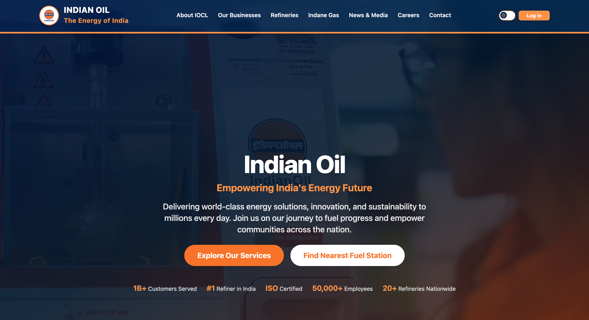

# Indian Oil Corporation Ltd (IOCL) Website



iocl-website.vercel.app

## About

This is the non-official website for Indian Oil Corporation Ltd (IOCL), featuring a modern React-based interface with Tailwind CSS styling. The website showcases IOCL's various business segments, services, and corporate information.

## Features

- **Modern UI/UX**: Built with React and Tailwind CSS for a responsive, modern design
- **Multiple Pages**: Home, About, Refineries, Indane Gas, Careers, and more
- **Interactive Components**: Smooth scrolling navigation, forms, and dynamic content
- **Responsive Design**: Optimized for desktop, tablet, and mobile devices
- **Professional Branding**: Consistent IOCL branding throughout the site

## Technology Stack

- **Frontend**: React 18 with Vite
- **Styling**: Tailwind CSS
- **Routing**: React Router
- **Build Tool**: Vite with HMR (Hot Module Replacement)
- **Linting**: ESLint for code quality

## Getting Started

### Prerequisites

- Node.js (version 16 or higher)
- npm or yarn package manager

### Installation

1. Clone the repository:
```bash
git clone <repository-url>
cd iocl_website
```

2. Install dependencies:
```bash
npm install
```

3. Start the development server:
```bash
npm run dev
```

4. Open your browser and navigate to `http://localhost:5173`

### Building for Production

```bash
npm run build
```

## Project Structure

```
iocl_website/
├── public/                 # Static assets
├── src/
│   ├── assets/            # Images and media files
│   ├── components/        # React components
│   │   ├── About/         # About page components
│   │   ├── Navbar/        # Navigation components
│   │   └── ...           # Other component directories
│   ├── App.jsx           # Main application component
│   ├── main.jsx          # Application entry point
│   └── index.css         # Global styles
├── index.html            # HTML template
└── package.json          # Project dependencies
```

## Pages and Sections

- **Home**: Hero section, business overview, news, and popular services
- **About**: Company information, achievements, and corporate details
- **Refineries**: Refinery capacity and safety information
- **Indane Gas**: LPG booking and service information
- **Careers**: Job opportunities and career information
- **Contact**: Contact information and location details

## Development

This project uses Vite for fast development with HMR and ESLint for code quality. The template provides a minimal setup to get React working efficiently.

Currently, two official plugins are available:

- [@vitejs/plugin-react](https://github.com/vitejs/vite-plugin-react/blob/main/packages/plugin-react) uses [Babel](https://babeljs.io/) for Fast Refresh
- [@vitejs/plugin-react-swc](https://github.com/vitejs/vite-plugin-react-swc) uses [SWC](https://swc.rs/) for Fast Refresh

## Expanding the ESLint configuration

If you are developing a production application, we recommend using TypeScript with type-aware lint rules enabled. Check out the [TS template](https://github.com/vitejs/vite/tree/main/packages/create-vite/template-react-ts) for information on how to integrate TypeScript and [`typescript-eslint`](https://typescript-eslint.io) in your project.

Currently, two official plugins are available:

- [@vitejs/plugin-react](https://github.com/vitejs/vite-plugin-react/blob/main/packages/plugin-react) uses [Babel](https://babeljs.io/) for Fast Refresh
- [@vitejs/plugin-react-swc](https://github.com/vitejs/vite-plugin-react/blob/main/packages/plugin-react-swc) uses [SWC](https://swc.rs/) for Fast Refresh

## Expanding the ESLint configuration

If you are developing a production application, we recommend using TypeScript with type-aware lint rules enabled. Check out the [TS template](https://github.com/vitejs/vite/tree/main/packages/create-vite/template-react-ts) for information on how to integrate TypeScript and [`typescript-eslint`](https://typescript-eslint.io) in your project.
# iocl_website
